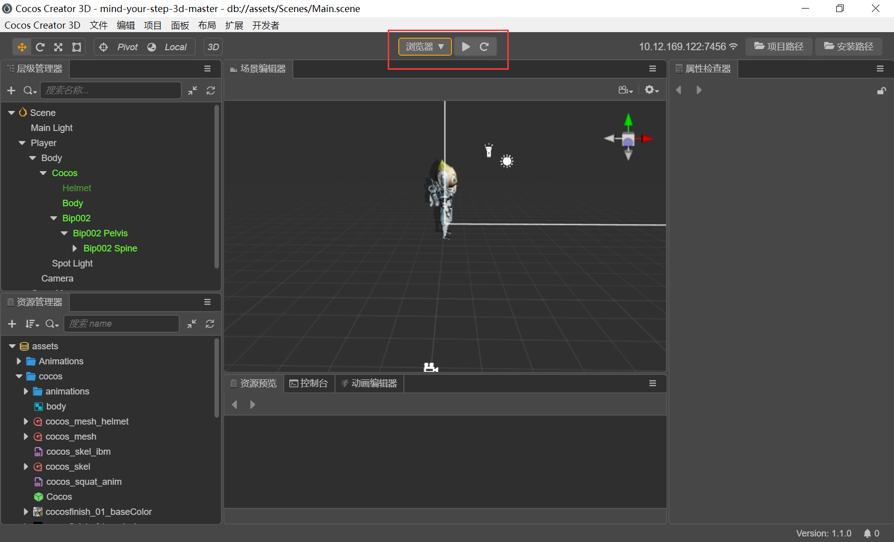
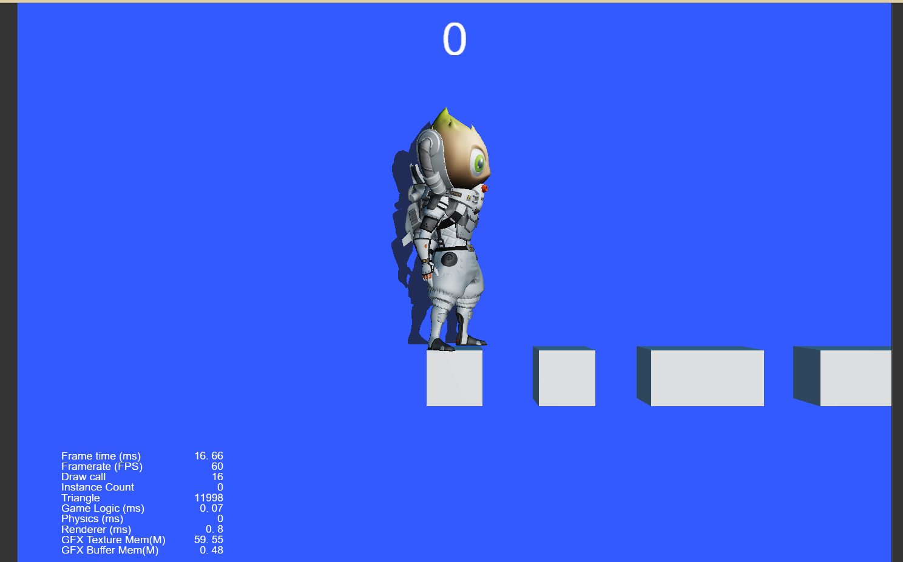
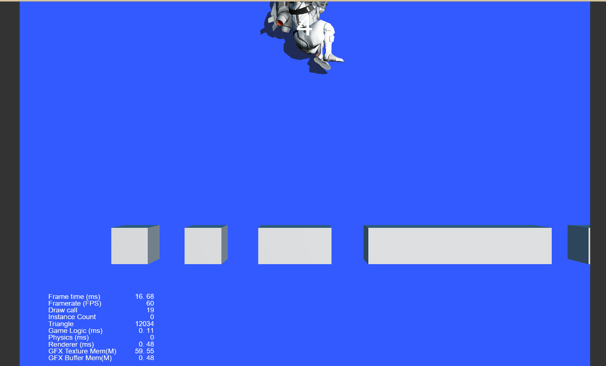
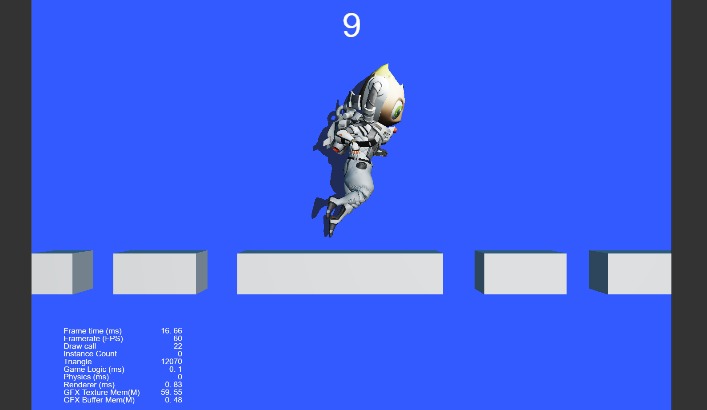

# mind-your-step（一步两步）
mind-your-step（也叫一步两步）是基于cocos游戏引擎的官方教程初步尝试的小游戏，入门者的第一次尝试。

## Get started

环境：

- Creator3D 1.1.0

## Run it

打开Creator点击浏览器运行即可进入游戏。

## Figures show

效果图如下：

动态gif图如下：

## Conclusion

~~做游戏果然是动画最难。~~

第二个难点是用脚本控制模型移动和静止时摇摆。

阴影是通过调整camera组件获得一个较好的效果。

Typescript语言控制脚本行为。

## Reference

[使用cocos引擎制作第一个小游戏](https://docs.cocos.com/creator/3.3/manual/zh/getting-started/first-game/)
